# Отчет по дипломному проекту

# 1. Сайт

Для обеспечения отказоустойчивости веб-приложения были развернуты два идентичных веб-сервера web-1 и web-2 под управлением Nginx. Серверы размещены в разных зонах доступности Yandex Cloud и не имеют публичных IP-адресов.

Для распределения трафика настроен Application Load Balancer. В его состав входят:

- Target Group с серверами web-1 и web-2;
- Backend Group с HTTP Health Check;
- HTTP Router с маршрутом "/";
- Listener на порту 80.

Балансировщик распределяет HTTP-запросы между двумя экземплярами веб-приложения.

## Виртуальные машины

На рисунке представлены виртуальные машины web-1 и web-2, используемые в качестве веб-серверов. Серверы размещены в разных зонах доступности (ru-central1-a и ru-central1-b) для обеспечения отказоустойчивости. Публичные IP-адреса отсутствуют, доступ осуществляется только через внутреннюю сеть и Bastion Host.

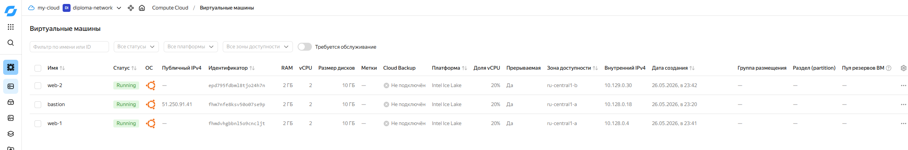

## Целевая группа балансировщика

Создана целевая группа web-target-group, в которую включены оба веб-сервера: web-1 (10.128.0.4) и web-2 (10.129.0.30).

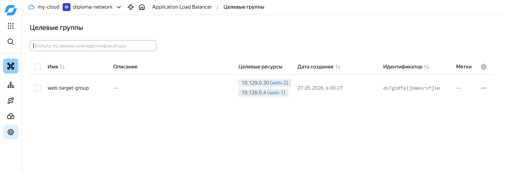

## Группа бэкендов

Создана группа бэкендов web-backend-group. В качестве источника серверов используется ранее созданная целевая группа web-target-group.

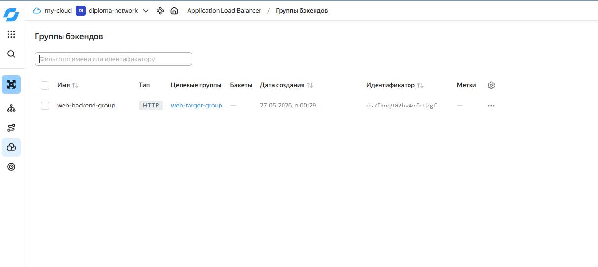

## HTTP Router

Для обработки входящих запросов создан HTTP Router web-router.

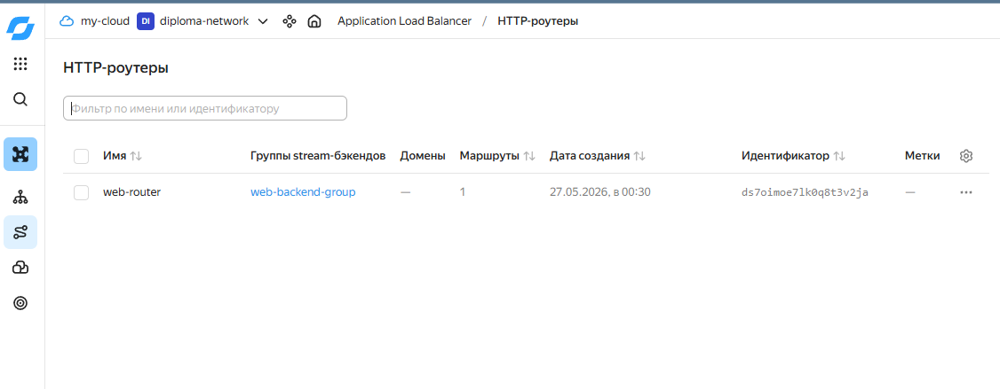

## Application Load Balancer

Создан балансировщик нагрузки web-balancer.


## Проверка балансировки

`http://89.169.152.30/`

Первый запрос к балансировщику возвращает ответ от web-1.


Повторный запрос возвращает ответ от web-2.


# 2. Мониторинг

Для централизованного мониторинга инфраструктуры был развернут сервер Zabbix 7.4. На виртуальных машинах `web-1` и `web-2` установлен и настроен Zabbix Agent 2, осуществляющий передачу метрик серверу мониторинга по внутренней сети. Для сбора системных показателей использован шаблон **Linux by Zabbix Agent**.

В системе реализован мониторинг по методологии **USE (Utilization, Saturation, Errors)**, позволяющий контролировать использование вычислительных ресурсов, уровень нагрузки и наличие ошибок в работе инфраструктуры.

Контролируются следующие показатели:

- загрузка процессора (CPU Utilization);
- использование оперативной памяти (Memory Utilization);
- использование дисковой подсистемы (Disk Utilization);
- сетевой трафик;
- средняя нагрузка на систему (Load Average);
- доступность веб-приложения по HTTP;
- состояние служб и операционной системы.

---

## Подключение контролируемых узлов к системе мониторинга

В систему мониторинга добавлены контролируемые узлы `web-1` и `web-2`. На каждом сервере установлен Zabbix Agent 2, обеспечивающий передачу метрик серверу мониторинга. Для обоих узлов успешно применяется шаблон **Linux by Zabbix Agent**. Статус Availability подтверждает корректное взаимодействие агентов с сервером Zabbix.

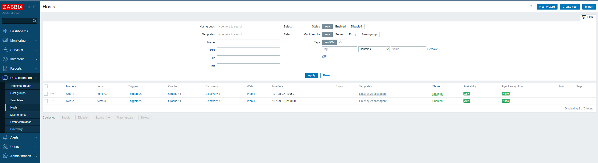

*Скриншот 1. Подключение контролируемых узлов к системе мониторинга.*

---

## Мониторинг доступности веб-приложения

Для контроля работоспособности веб-сервиса настроены Web Scenarios (Web Monitoring) для серверов `web-1` и `web-2`. Выполняется регулярная проверка доступности HTTP-сервиса с интервалом 1 минута.

Мониторинг позволяет контролировать:

- доступность веб-приложения;
- время отклика сервиса;
- корректность HTTP-кода ответа.

Данный механизм используется для контроля доступности веб-приложения и соответствует компоненту **Errors** методологии USE.

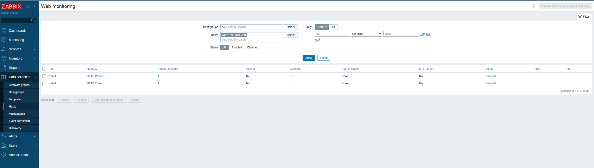

*Скриншот 2. Настройка мониторинга доступности веб-сервисов.*

---

## Дашборд мониторинга USE

Для визуального контроля состояния инфраструктуры создан пользовательский дашборд **USE Monitoring**.

На дашборде отображаются основные показатели серверов `web-1` и `web-2`.

### Utilization

- CPU Utilization;
- Memory Utilization;
- Disk Utilization.

### Saturation

- Load Average;
- показатели сетевой активности.

### Errors

- результаты HTTP-проверок;
- HTTP-коды ответов;
- время отклика веб-сервисов.

Для контроля критичных показателей используются встроенные триггеры Zabbix и пороговые значения, позволяющие своевременно обнаруживать отклонения в работе системы.

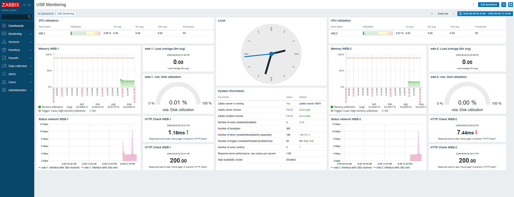

*Скриншот 3. Дашборд мониторинга по методологии USE.*

---

## Настройка триггеров мониторинга

Для серверов `web-1` и `web-2` используются триггеры шаблона **Linux by Zabbix Agent**.

Настроен контроль следующих параметров:

- загрузка процессора;
- использование оперативной памяти;
- заполнение файловых систем;
- количество свободных inode;
- доступность сервисов;
- состояние операционной системы.

При превышении установленных пороговых значений автоматически формируются события и уведомления, что обеспечивает своевременное обнаружение неисправностей и деградации производительности.

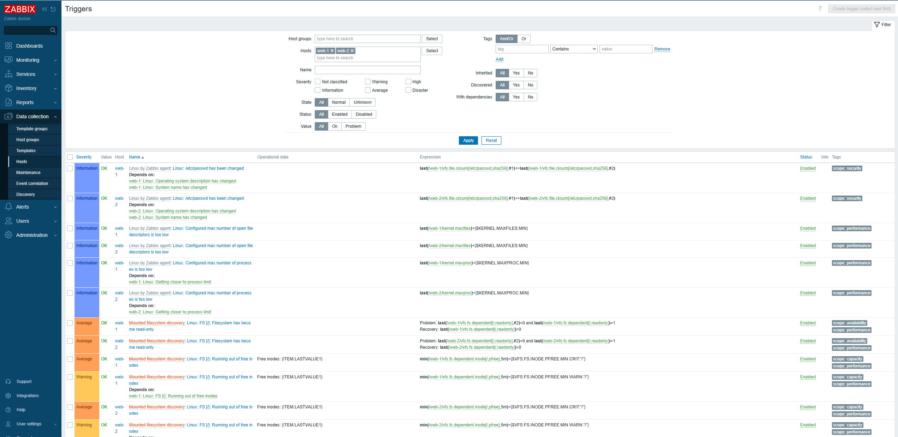

*Скриншот 4. Настройка триггеров контроля состояния серверов.*

Конфигурация сервиса:

- [Zabbix Docker Compose](../deploy/zabbix/docker-compose.yml)

# 3. Централизованный сбор и анализ логов

Для централизованного хранения и анализа журналов работы веб-приложения развернут стек Elastic Stack, включающий следующие компоненты:

- Elasticsearch — хранение и индексирование логов;
- Filebeat — сбор и передача журналов с веб-серверов;
- Kibana — визуализация и анализ данных.

На серверах `web-1` и `web-2` настроен сбор журналов веб-сервера Nginx (`access.log` и `error.log`) с последующей передачей в Elasticsearch.

---

## Проверка работоспособности Elasticsearch

После развертывания выполнена проверка доступности сервиса Elasticsearch с использованием REST API.

Команда:

```bash
curl localhost:9200
```

В ответ получена информация о кластере, версии программного обеспечения и состоянии узла, что подтверждает корректную работу сервиса.

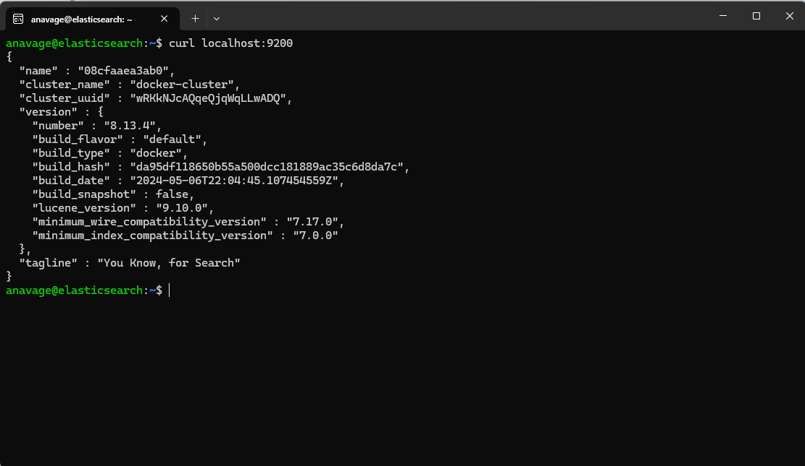

*Скриншот 1. Проверка работоспособности Elasticsearch.*

---

## Настройка Filebeat на сервере web-1

На веб-сервере `web-1` установлен и настроен агент Filebeat, выполняющий сбор журналов Nginx и передачу данных в Elasticsearch.

Команда проверки:

```bash
systemctl status filebeat
```

Служба находится в состоянии `active (running)`, что подтверждает корректную работу агента.

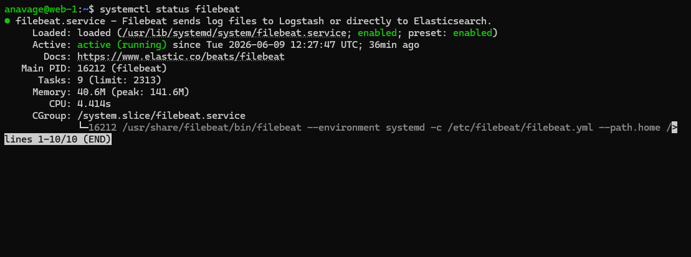

*Скриншот 2. Состояние службы Filebeat на сервере web-1.*

---

## Настройка Filebeat на сервере web-2

Аналогичная конфигурация выполнена на сервере `web-2`. Filebeat осуществляет сбор и передачу журналов веб-сервера во внутреннее хранилище Elasticsearch.

Команда проверки:

```bash
systemctl status filebeat
```

Служба успешно запущена и работает в штатном режиме.

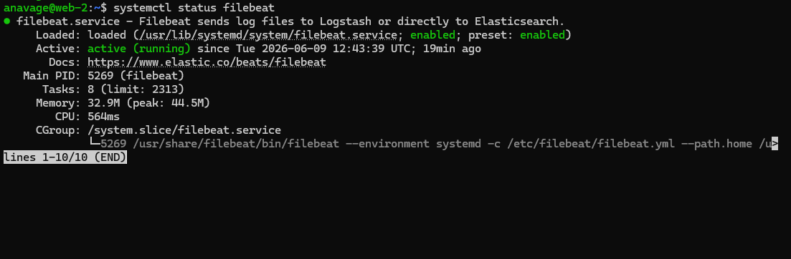

*Скриншот 3. Состояние службы Filebeat на сервере web-2.*

Конфигурация Filebeat:

- [filebeat.yml](../deploy/filebeat/filebeat.yml)

---

## Проверка поступления данных в Elasticsearch

Для подтверждения поступления логов выполнена проверка списка индексов Elasticsearch.

Команда:

```bash
curl localhost:9200/_cat/indices?v
```

Конфигурация Elasticsearch:

- [docker-compose.yml](../deploy/elastic/docker-compose.yml)

В результате обнаружен индекс `.ds-filebeat-*`, автоматически созданный Filebeat. Наличие документов в индексе подтверждает успешную передачу журналов от веб-серверов.

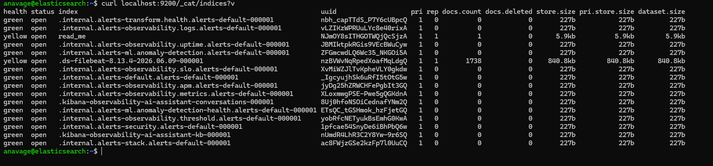

*Скриншот 4. Проверка индексов Elasticsearch.*

---

## Анализ логов в Kibana

Для визуального анализа журналов развернут сервер Kibana и настроено подключение к Elasticsearch.

В разделе **Discover** создано представление данных `filebeat-*`, позволяющее просматривать поступающие журналы в режиме реального времени.

На скриншоте отображаются события от серверов `web-1` и `web-2`, включая записи журнала доступа Nginx (`access.log`).

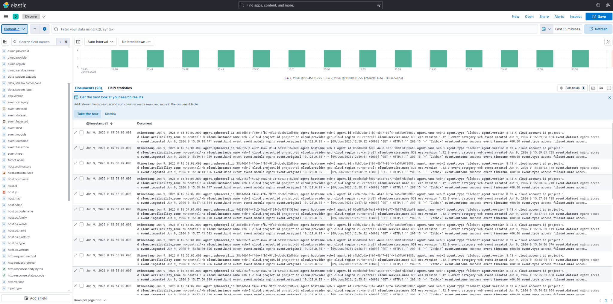

*Скриншот 5. Просмотр журналов в интерфейсе Kibana.*

Конфигурация Kibana:

- [docker-compose.yml](../deploy/kibana/docker-compose.yml)
---

## Результаты реализации подсистемы логирования

В рамках проекта реализована централизованная система сбора и анализа логов на базе Elastic Stack.

Выполнены следующие работы:

- развернут сервер Elasticsearch;
- развернут сервер Kibana;
- настроен Filebeat на серверах `web-1` и `web-2`;
- организован сбор журналов Nginx;
- настроена автоматическая передача логов в Elasticsearch;
- выполнена визуализация данных в Kibana.

Результаты проверки подтверждают корректную работу всех компонентов системы и успешное поступление журналов веб-приложения в централизованное хранилище.

# 4. Сетевая инфраструктура

Для обеспечения безопасного доступа к сервисам и изоляции внутренних ресурсов была настроена виртуальная сеть Yandex Cloud (VPC), включающая две подсети, NAT Gateway, таблицу маршрутизации и Bastion Host.

---

## Виртуальные машины

В инфраструктуре развернуты следующие виртуальные машины:

| Сервер | Назначение | Публичный IP |
|----------|----------|----------|
| bastion | Bastion Host | Да |
| web-1 | Веб-сервер Nginx | Нет |
| web-2 | Веб-сервер Nginx | Нет |
| elasticsearch | Хранилище логов | Нет |
| kibana | Визуализация логов | Да |
| zabbix-server | Мониторинг | Да |

В соответствии с требованиями дипломного проекта веб-серверы и Elasticsearch размещены во внутреннем контуре без публичных IP-адресов.

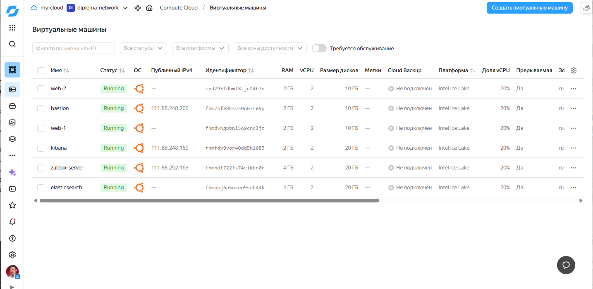

*Скриншот 1. Виртуальные машины инфраструктуры.*

---

## Подсети VPC

Для обеспечения отказоустойчивости созданы две подсети в различных зонах доступности:

- ru-central1-a — 10.128.0.0/24
- ru-central1-b — 10.129.0.0/24

Обе подсети используют единую таблицу маршрутизации private-route.

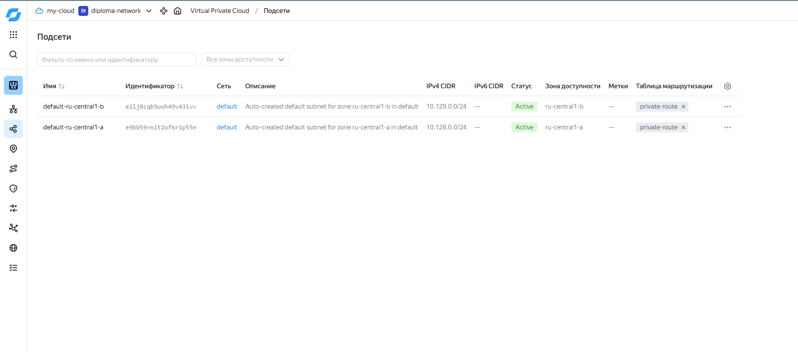

*Скриншот 2. Подсети виртуальной сети.*

---

## NAT Gateway

Для предоставления доступа в Интернет виртуальным машинам без публичных IP-адресов создан NAT Gateway.

Через данный шлюз осуществляется выход во внешнюю сеть для:

- web-1;
- web-2;
- elasticsearch.

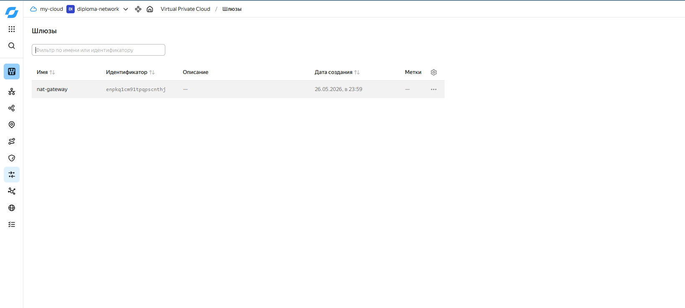

*Скриншот 3. NAT Gateway.*

---

## Таблица маршрутизации

Создана таблица маршрутизации private-route.

Настроен маршрут по умолчанию:

```text
0.0.0.0/0 → nat-gateway
```

Благодаря этому весь исходящий трафик внутренних серверов направляется через NAT Gateway.

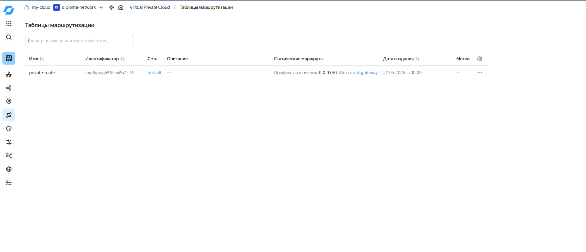

*Скриншот 4. Таблица маршрутизации private-route.*

---

## Проверка работы NAT

Для проверки работоспособности NAT выполнен запрос к внешнему сервису определения IP-адреса.

Команда:

```bash
curl ifconfig.me
```

В ответ получен внешний IP-адрес, что подтверждает наличие доступа в Интернет при отсутствии публичного IP на виртуальной машине.

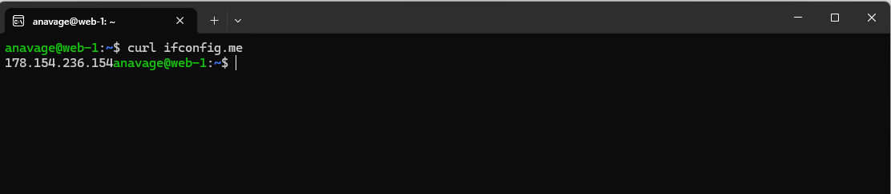

*Скриншот 5. Проверка работы NAT Gateway.*

---

## Группы безопасности

Для каждого сервиса созданы отдельные группы безопасности:

- bastion-sg;
- web-sg;
- elasticsearch-sg;
- kibana-sg;
- zabbix-sg.

Настроены правила входящего и исходящего трафика в соответствии с принципом минимально необходимых привилегий.

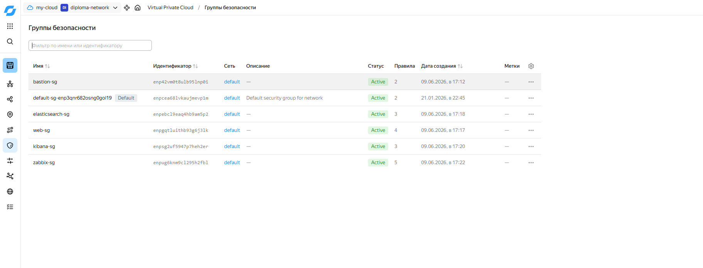

*Скриншот 6. Группы безопасности.*

---

## Bastion Host

Для доступа к серверам внутреннего контура используется Bastion Host.

Серверы web-1, web-2 и elasticsearch не имеют публичных IP-адресов и доступны только через Bastion Host.

### Подключение к web-1

Подключение выполнено по внутреннему адресу:

```text
10.128.0.4
```

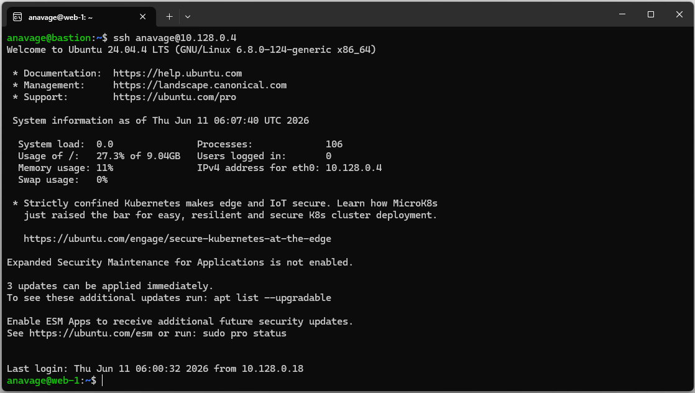

*Скриншот 7. Подключение к web-1 через Bastion Host.*

---

### Подключение к web-2

Подключение выполнено по внутреннему адресу:

```text
10.129.0.30
```

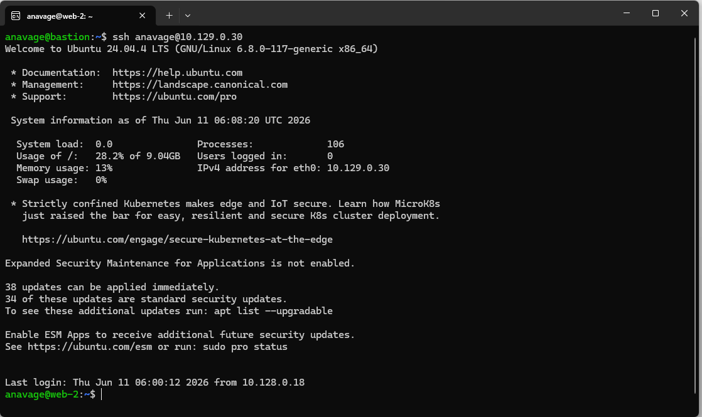

*Скриншот 8. Подключение к web-2 через Bastion Host.*

---

### Подключение к Elasticsearch

Подключение выполнено по внутреннему адресу:

```text
10.128.0.29
```

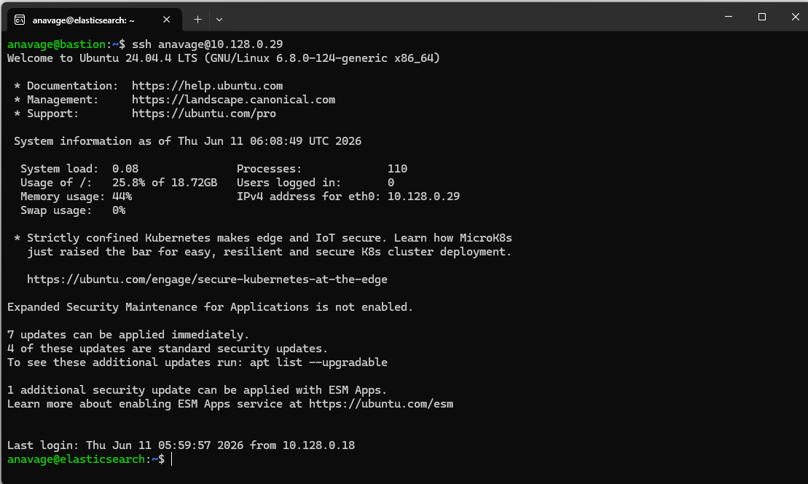

*Скриншот 9. Подключение к Elasticsearch через Bastion Host.*

# 5. Резервное копирование

Для обеспечения отказоустойчивости инфраструктуры было настроено автоматическое резервное копирование виртуальных машин средствами Yandex Cloud Snapshot Schedule.

Создано расписание резервного копирования `daily-backup`, которое выполняет создание снимков дисков ежедневно в 02:00.

Параметры резервного копирования:

- расписание: ежедневно в 02:00;
- срок хранения снимков: 7 дней;
- автоматическое удаление устаревших резервных копий;
- резервное копирование всех виртуальных машин инфраструктуры.

В расписание включены диски следующих серверов:

- bastion;
- web-1;
- web-2;
- elasticsearch;
- kibana;
- zabbix-server.

Данный механизм позволяет восстановить виртуальные машины в случае сбоя, повреждения данных или ошибочных действий администратора.

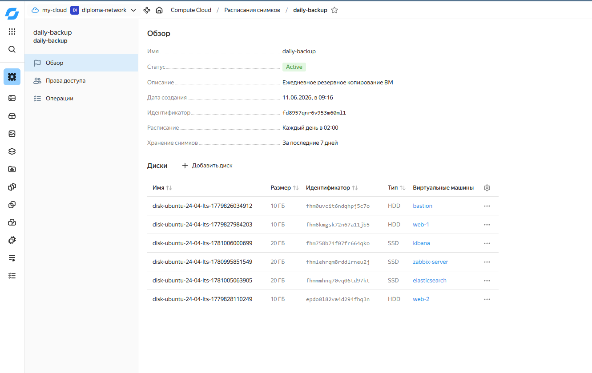

*Скриншот 1. Настроенное расписание резервного копирования виртуальных машин.*

---

## Результаты реализации сетевой инфраструктуры

В рамках проекта выполнено:

- создание виртуальной сети VPC;
- настройка двух подсетей в разных зонах доступности;
- настройка NAT Gateway;
- создание таблицы маршрутизации;
- организация доступа к внутренним серверам через Bastion Host;
- настройка групп безопасности.

В результате обеспечена безопасная сетевая архитектура, соответствующая требованиям дипломного проекта и исключающая прямой доступ к внутренним серверам из сети Интернет.

# 6. Конфигурационные файлы проекта

Для воспроизводимости настройки основные конфигурационные файлы вынесены в каталог `deploy/`.

## Elasticsearch

Файл конфигурации Docker Compose для Elasticsearch:

[deploy/elastic/docker-compose.yml](../deploy/elastic/docker-compose.yml)

Используется для запуска Elasticsearch в Docker-контейнере. Сервис принимает данные от Filebeat на порту `9200`.

---

## Kibana

Файл конфигурации Docker Compose для Kibana:

[deploy/kibana/docker-compose.yml](../deploy/kibana/docker-compose.yml)

Используется для запуска Kibana и подключения к Elasticsearch.

---

## Zabbix

Файл конфигурации Docker Compose для Zabbix:

[deploy/zabbix/docker-compose.yml](../deploy/zabbix/docker-compose.yml)

Используется для запуска сервера мониторинга Zabbix.

---

## Filebeat

Файл конфигурации Filebeat:

[deploy/filebeat/filebeat.yml](../deploy/filebeat/filebeat.yml)

Filebeat установлен на серверах `web-1` и `web-2` и используется для сбора логов Nginx с последующей отправкой в Elasticsearch.
